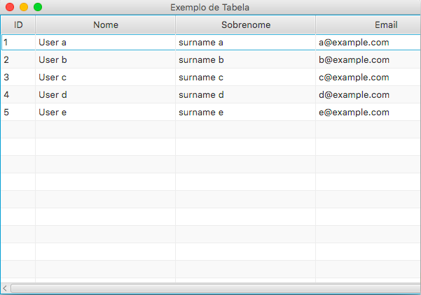

# Exemplos JavaFX

Coleção de exemplos de utilização da interface gráfica do JavaFX

Projeto criado com IntelliJ IDEA


## Sumário

1. Hello World
2. Ações de componentes
    1. Clique no botão
    2. Clique no check box
    3. Obter valor do campo de texto
    4. Ocultar um componente
    5. Clique em um item de uma ListView
    6. [Duplo clique em um registro em um TableView](src/br/com/leandersonandre/javafx/exemplos/acoes/duploclicknoregistrotableview)
3. Layouts
    1. [Menu Lateral](#menu-lateral)
    2. [Exemplo de ImageView](src/br/com/leandersonandre/javafx/exemplos/layout/imagem)
    3. [Botão com ícone](#botão-com-ícone)
    4. [TableView](#tableview)
    5. [TableView com botão](src/br/com/leandersonandre/javafx/exemplos/layout/tableviewcombotao)
                                  
    
## Menu Lateral

 

Acesse o [exemplo completo](br/com/leandersonandre/javafx/exemplos/layout/menulateral).

## Botão com ícone

    

Acesse o [exemplo completo](br/com/leandersonandre/javafx/exemplos/layout/botaocomicone).
    
## TableView




O primeiro passo é criar a classe modelo que irá representar os dados que serão dispostos na tabela.
Observe que o atributo deverá ser uma classe do pacote ``javafx.beans.property.*``. Por exemplo, atributos tipo long utilize ``SimpleLongProperty``, tipo String utilize ``SimpleStringProperty``.

 
```java
public class User {

    private SimpleLongProperty id;
    private SimpleStringProperty name;
    
    public long getId() {
        // chame o método get para retornar o valor do atributo
        return id.get();
    }

    public void setId(long id) {
        // chame o método set para atualizar o valor do atributo
        this.id.set(id);
    }

    public String getName() {
        return name.get();
    }

    public void setName(String name) {
        this.name.set(name);
    }
}
``` 

No arquivo fxml (Tela), dentro do elemento ``TableView`` adicione suas colunas, elemento ``TableColumn``.
Adicione o elemento ``cellValueFactory`` dentro do elemento ``TableColumn`` e indique o ``property``.
O property deve ter o mesmo nome do atributo que está na classe modelo.
```xml
<TableColumn prefWidth="50.0" text="ID">
    <cellValueFactory>
        <PropertyValueFactory property="id" />
    </cellValueFactory>
</TableColumn>
```

No controler da tela, crie a lista de itens.
```java
private final ObservableList<User> data =
            FXCollections.observableArrayList(
                    new User(1, "User a","surname a", "a@example.com"),
                    new User(2, "User b", "surname b","b@example.com"),
                    new User(3, "User c", "surname c","c@example.com"),
                    new User(4, "User d", "surname d","d@example.com"),
                    new User(5, "User e", "surname e","e@example.com")
            );
```

Em seguida, relacione a TableView da tela com o atributo do controller.

```java
public class Controller{

    @FXML
    public TableView tableView;
}
```


```fxml
<TableView fx:id="tableView" prefHeight="400.0" prefWidth="650.0">
</TableView
```

Implemente na classe Controller a interface ``Initializable`` e o método ``initialize``. Dentro do método adicione a lista de itens no ``TableView``.

```java
public class Controller implements Initializable {
    @Override
    public void initialize(URL location, ResourceBundle resources) {
        tableView.setItems(data);
    }
}
```

Acesse o [exemplo completo](src/br/com/leandersonandre/javafx/exemplos/layout/tableview).
